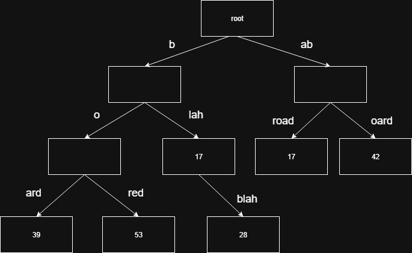

# Ejercicio 1  

## Punto A  

El objetivo de los Merkle Trees es autenticar que el contenido devuelto por un servidor coincide con el contenido original, sin necesidad de almacenar dicho contenido localmente. De esta forma, el usuario puede verificar la autenticidad de lo recibido, ya sea el archivo completo o un bloque específico, sin necesidad de guardar el archivo original localmente.  

El usuario solo necesita guardar un único hash: la raíz del Merkle Tree, cuyo tamaño es muy inferior al del archivo original. Al recibir información del servidor, el usuario puede comprobar su validez hasheando el contenido y verificando si el resultado coincide con el hash almacenado, mediante una *prueba de inclusión*.  

Las funciones de hash, aunque no necesariamente criptográficas, permiten representar el contenido original de manera mucho más compacta que guardando el archivo completo. Esto se debe a que mapean entradas de tamaño arbitrario a valores de longitud fija. Como el ejemplo que vimos en clase, donde bloques de 1 KB de datos se mapean a hashes de solo 32 bytes.  

El procedimiento consiste en que, antes de enviar el archivo al servidor, el usuario calcula el árbol de hashes, donde cada hoja es el hash del bloque original, y cada nodo que no es una hoja es el hash de la concatenación de los hashes de sus hijos.  

  

Es importante destacar que los Merkle Trees *no* permiten recuperar el contenido en caso de que el servidor devuelva datos incorrectos, pero sí permiten verificar si lo que devuelve coincide o no con lo que se guardó. Esto ocurre por el uso de funciones de hash criptográficas, las cuales son de un solo sentido (*one-way*), por lo que resulta computacionalmente imposible obtener la preimagen de un hash.  

El aspecto fundamental de utilizar funciones de hash criptográficas es que resulta computacionalmente imposible encontrar dos entradas distintas que produzcan el mismo valor de hash. Si esto fuera sencillo, un servidor malicioso podría, al solicitarse un bloque junto con la cadena de hashes correspondiente para verificar su inclusión, entregar un bloque modificado junto con hashes falsos que, sin embargo, reproduzcan la misma raíz que el usuario tiene almacenada. De ese modo, podría engañar al usuario entregándole un bloque incorrecto.  

Como en la práctica es computacionalmente imposible encontrar colisiones, este esquema resulta seguro para realizar pruebas de inclusión o de no inclusión. Porque la única manera de que sea verdadera la prueba de inclusión es enviando el bloque verdadero y los hashes que hacen valer la prueba de inclusión.  

## Punto B
Por lo que investigue, si se quiere formar un arbol con una cantidad de transacciones que no es una potencia de 2, se duplica la ultima para tener un arbol completo con cantidad de hojas igual a una potencia de dos. [Link 1](URLhttps://bitcoin.stackexchange.com/questions/79364/are-number-of-transactions-in-merkle-tree-always-even), [Link 2](https://www.geeksforgeeks.org/software-engineering/blockchain-merkle-trees/)
Otras posible solucion que vi es completar el arbol con un valor por default [Link 3](https://ethresear.ch/t/merkle-tree-formation-with-odd-number-of-leaves/2681). Asi que debajo dejo un esquema que sigue el formato de la clase y repite el ultimo bloque para tener una cantidad de hojas igual a una potencia de dos. 

  

Importante aclarar que, dado que las funciones de hash son determinísticas y para un valor de entrada solo pueden devolver un valor de salida, $H_5 = H_6 = H_7 = H_8$ y $H_{56} = H_{78}$. Pero me parece más claro el esquema numerando los hashes por el orden.


## Punto C
 

# Ejercicio 2
## Punto A
Suponiendo que el día en el que nace una persona es equiprobable, cosa que en la realidad no debe ser cierto:

Sea $S$ el espacio muestral $S = {w \mid w \in \mathbb{N} \land w \in {1,2,\ldots,365}}$. Que representa el día que cumple años una persona.

$P(A_i = x) = \frac{1}{365}$ Con $x \in S$ y $A_i$ el día que cumple la persona i-ésima.

Queremos encontrar la probabilidad de que la fecha de cumpleaños de la persona $i$, sea igual a la de la persona $j$, con $i \neq j$ y $i$ y $j$ índices válidos de personas dentro de la cantidad de personas que estamos contando.

Yo quiero encontrar $P({A_i = A_j / i \neq j \land i \in k \land j \in k})$. Donde $k$ es el conjunto de los índices de las personas.

Esto va a ser igual a $P(\bigcup_{\substack{i,j \ i \neq j}}^{k} { A_i = A_j }) = 1 - P((\bigcup_{\substack{i,j \ i \neq j}}^{k} { A_i = A_j })^c) \overset{\text{por De Morgan}}{=} 1 -\bigcap_{\substack{i,j \ i \neq j}}^{k} { A_i \neq A_j } = \frac{365 \times 364 \times \ldots 365 - k - 1}{365^k}$.

En esta última expresión el numerador sería nuestros casos positivos, donde no hay dos personas con el mismo cumpleaños, dividido los casos totales que son todos los posibles cumpleaños.

Generalizándolo, suponiendo que llamamos $n$ a las posibles fechas, a lo que llegamos es:

$1 - \frac{n \times (n - 1) \times (n-2) \ldots (n - q + 1)}{n^k} = 1 - (\frac{n}{n} \times \frac{n-1}{n} \ldots \times \frac{n - k + 1}{n}) = 1 - \prod_{l=0}^{k-1} \frac{n-l}{n} = 1 - \prod_{l=0}^{k-1} 1 - \frac{l}{n}$

Para poder aproximar esta última productoria, puedo usar la desigualdad: $1 - x \leq e^{-x}$, por lo tanto sea $x = \frac{l}{n}$:

$1 - \frac{l}{m} \leq e^{-\frac{l}{n}}$.

Por lo tanto $\prod_{l=0}^{k-1} 1 - \frac{l}{n} \leq \prod_{l=0}^{k-1} e^{-\frac{l}{n}}$

Y, como multiplicar una exponencial, es igual a mantener su base y sumar los exponentes:

$\prod_{l=0}^{k-1} e^{-\frac{l}{n}} = e^{\sum_{l=0}^{k-1}-\frac{l}{n}} = e^{-\frac{1}{n}\sum_{l=0}^{k-1}l}$

Como $\sum_{l=0}^{k-1}l = \frac{k(k-1)}{2}$:

$e^{-\frac{1}{n}\sum_{l=0}^{k-1}l} = e^{-\frac{1}{n}\frac{k(k-1)}{2}} = e^{-\frac{k(k-1)}{2n}}$

Por lo tanto, para que dos personas tengan una probabilidad mayor al 50% de cumplir años el mismo día habría que resolver:

$1 - e^{-\frac{k(k-1)}{2n}} > \frac{1}{2} \iff -e^{-\frac{k(k-1)}{2n}} > -\frac{1}{2} \iff e^{-\frac{k(k-1)}{2n}} < \frac{1}{2}$

Tomo logaritmo natural de los dos lados para sacarme de encima la exponencial:

$-\frac{k(k-1)}{2n} < ln(\frac{1}{2})$

Y como $ln(\frac{1}{2}) = -ln(2)$, uso eso para sacarme el menos de encima de la expresión.

$-\frac{k(k-1)}{2n} < -ln(2)$ $\iff$ $\frac{k(k-1)}{2n} > ln(2) \iff k(k-1) > 2n \times ln(2)$

Como $n$ se refiere a los posibles días del año para cumplir, lo reemplazo por 365, para ver el número de gente necesario ($k$), para tener una probabilidad mayor al 50% de que dos de ellas cumplan años el mismo día.

$k(k-1) > 2 \times 365 \times ln(2) \iff k(k-1) > 730 \times ln(2) \iff k^{2} - k - 730 \times ln(2) > 0 \iff k > 23$ (Tomando $K \in \mathbf{N}$)

Por lo tanto, la cantidad de gente necesaria, para que haya un 50% de probabilidad de compartir cumpleaños es 23.

En este ejercicio, para el punto clave que es acotar la productoria por la sumatoria de la exponencial, me tiró el centro Juan Cruz Montero, que se lo explicó Francisco el jueves que hubo clase de consulta.

## Punto B
Viendo el documento de las posibles claves, hay $2048$ ($2^{11}$) posibles palabras, y si en una seed se pueden repetir palabras hay $(2^{11})^{12}$ posibles contraseñas. Un numero de 40 digitos. 

Por lo tanto, relacionandolo con el ejercicio anterior ahora, dado $n = 2048^{12}$ queremos buscar el $k$ tal que: 

$k(k-1) > 2048^{12} \times ln(2) \iff k(k-1) > 2^{132} \times ln(2)$, aproximando, tomo $ln(2)$ como $\frac{1}{2}$, por lo que el resultado que me va a dar de K va a ser un poco más chico del verdadero, pero me va a simplificar las cuentas. 

$k(k-1) > 2^{131} \iff k^{2} - k - 2^{131} > 0$, que vale para, aproximadamente, $k = 2^{66}$, que es un numero de 20 digitos, un numero muchisimo mas grande que la cantidad de personas que viven en la tierra. 

# Ejercicio 3 
La función de hash propuesta recibe cadenas binarias de cualquier longitud y devuelve una cadena binaria de longitud $n$. La particularidad es que, si se ingresa una cadena de longitud $n$, la función no realiza ningún hash, sino que actúa como la función identidad. Para cadenas de otras longitudes, se comporta como una función de hash criptográfica, similar a las que vimos en clase.

Si el objetivo de esta función es evitar colisiones únicamente para entradas de longitud $n$, entonces cumple su propósito. Sin embargo, no tiene mucho sentido al querer hashear algo, no hashearlo, ya que esto va en contra de los objetivos de las funciones de hash: por un lado, representar la misma cantidad de información en un tamaño menor, y por otro, garantizar que el hash no sea reversible. Al ser conocida la función de hash, un atacante podría fácilmente probar si la preimagen de ese hash no es igual al hash. Por lo tanto es fácil encontrar para todo hash una entrada que este mapeada a ese hash, va en contra de la propiedad de la resistencia a las coliciones.

Si el objetivo es evitar colisiones en general, este diseño no lo logra. Solo asegura que no haya colisiones entre entradas de longitud $n$, pero una entrada de longitud $n$ podría colisionar con el hash de una entrada de longitud distinta. Por lo tanto, la función no garantiza resistencia a colisiones fuera del caso particular de cadenas de tamaño $n$.

La función no va a cumplir tampoco que sea poco probable que dos entradas distintas mapeen a lo mismo, porque para cada entrada de tamaño distinto a N, esta va a compartir salida con su propio hash. 

Algunas propiedades que sí cumple la función propuesta son que, si para cadenas de tamaño distinto a $n$ está bien implementada, es deterministica y es rápida de computar.

# Ejercicio 4
La idea de la demostración la saque principalmente de: [Fuente 1](https://scispace.com/pdf/attacks-on-some-rsa-signatures-4pe9259phw.pdf) (Sección 1.2) y [Fuente 2](https://www.reddit.com/r/crypto/comments/mzv1q6/can_someone_explain_an_existential_forgery_attack/?utm_source=share&utm_medium=web3x&utm_name=web3xcss&utm_term=1&utm_content=share_button).

Si el atacante tiene dos pares (mensaje, firma), como no usamos una función de hash para encriptar las firmas, el atacante va a tener los siguientes datos:

$$
s_1 = (m_1)^d \bmod N, \quad s_2 = (m_2)^d \bmod N \quad \text{(1)}
$$

Donde:

- $m_1$, $m_2$ son los mensajes, cuyos valores se conocen.
- $s_1, s_2$ son las firmas correspondientes, también conocidas.
- $d$ es la clave privada, valor *no* conocido por el atacante.
- $N$ es el módulo de RSA, su valor es conocido.

El atacante va a poder generar un nuevo par (mensaje, firma) haciéndose pasar por el autor legítimo.  

Definimos un nuevo mensaje y firma como:

$$
m_3 = (m_1 \times m_2) \quad \text{(2)}, \quad s_3 = (s_1 \times s_2) \quad \text{(3)}
$$

Recordando propiedades de congruencia, vale que:
$$
(a \times b)^e \equiv a^e \times b^e \pmod{N} \quad \text{(4)}
$$

Por lo tanto, podemos formar la siguiente cadena de congruencias:

$$
s_3^e \;\overset{(3)}{\equiv}\; (s_1 \times s_2)^e \;\overset{(4)}{\equiv}\; s_1^e \times s_2^e \;\overset{(1)}{\equiv}\; m_1 \times m_2 \;\overset{(2)}{\equiv}\; m_3 \pmod{N}
$$

Por lo tanto, es válido que, si alguien quiere verificar si la firma del mensaje es verídica, esta lo es porque cumple la ecuación $(s_3)^e \equiv m_3$ por la forma en la que los armamos.  

Por este motivo, es que no se usan firmas RSA planas, sino que se combinan con funciones de hash, y en vez de firmar el mensaje original, se firma un hash, porque los hashes *no* cumplen que $H(m_1) \times H(m_2) = H(m_1 \times m_2)$. Por lo tanto, por más que podamos encontrar valores que satisfagan la veracidad del mensaje, nunca vamos a poder encontrar un mensaje que hashee a ese hash que inventamos.

# Ejercicio 5
Si un atacante intenta modificar el contenido del bloque $B$ para cambiar la dirección del minero a la suya y así quedarse con la recompensa, no podrá lograrlo. Esto se debe a que cualquier cambio en el contenido del bloque altera su hash. El nonce que originalmente hacía que el hash fuera menor que el target deja de funcionar, y el bloque modificado deja de cumplir la condición de la PoW, por lo que la red lo considera inválido.

El atacante podría intentar buscar un nuevo nonce que haga que el bloque modificado cumpla la PoW, pero esto es básicamente lo mismo que minar un bloque desde cero. Por lo tanto, “robar” un bloque de esta manera no tiene sentido: es más eficiente minar su propio bloque para obtener la recompensa.

# Ejercicio 6
Primero, escribí el contrato en Solidity: 

```solidity
// SPDX-License-Identifier: MIT
pragma solidity >=0.7.0 <0.9.0;

contract Send {
    address payable public tiago_address = payable(0xA01A96bd5a91aA6b7e3CA90323Cb2aCE80ca4B09);

    receive() external payable {
        if(address(this).balance >= 0.05 ether) {
            send_eth_to_tiago();
        }
    }

    function send_eth_to_tiago() public {
        require(address(this).balance >= 0.05 ether, "No hay fondos suficientes");
        (bool ok, ) = tiago_address.call{value: 0.05 ether}("");
        require(ok, "Fallo el envio");
    }

    function deposit() external payable {}
}
```

Despues lo compile y lo deployee en remix sin darle un valor, [Link de etherscan al contrato](https://sepolia.etherscan.io/address/0x6901def5a7b5d868d9ae257d8b48c1b54521d265). Desde Remix le deposite 0.05 sepholia Eth. [Link etherscan contrato](https://sepolia.etherscan.io/tx/0xe11dc3fc515397587921a24b65f426afc68ae0ffca2c91c83c3dcde5b597be78) y por ultimo, una vez que ya tenía el eth llame a la función para enviarle el dinero a Tiago y se envio [Link llamado a función etherscan](https://sepolia.etherscan.io/tx/0x905e69f5895835a7d94b7b0a0e4f8cfaf6129e490c537745b8fc60e849ddef21)


# Ejercicio 7
## Punto A
El contrato define un Banco, que tiene como variables internas un "diccionario" que mapea direcciones a enteros sin signo de 256 bits, que se llama balance, y un array de direcciones que llama customers.

Se definen dos eventos, que se van a ejecutar cuando llamen a las funciones indicadas. Uno para cuando llamen a deposit, y otro para withdrawal.

Cuando alguien llama a deposit, primero se verifica que la cantidad de ETH que el usuario envió sea mayor a 10 weis. Si se cumple, la función continúa, si no, se corta y se le devuelve el ETH al usuario. Si se envían más de 10 weis, se actualiza el balance del usuario, restándole 10 weis. Después se lo agrega a la lista de clientes y se registra en el evento Deposit la dirección del que llamo a la función y el mensaje enviado.

Al llamar a withdraw, se vacía el balance del usuario que llamo a la función y se le transfiere su saldo guardado. Por último, se registra en el evento Withdrawal quién fue el que llamó a la función.

getBalance devuelve el balance guardado por el banco para el usuario que llama la función.

La función empty primero verifica que quien la llamó sea el primer cliente, si lo es, se le transfiere todo el balance del contrato. No parece un banco muy descentralizado O.O.

## Punto B
Había interactuado con el contrato viejo, previo a que modificaron su dirección, por lo que deposite pero no pude retirar. [Link del deposito](https://sepolia.etherscan.io/tx/0x47ba314c2d77d78d654640047ee820e476b0f7158053cc97659b3172df354ba2)


